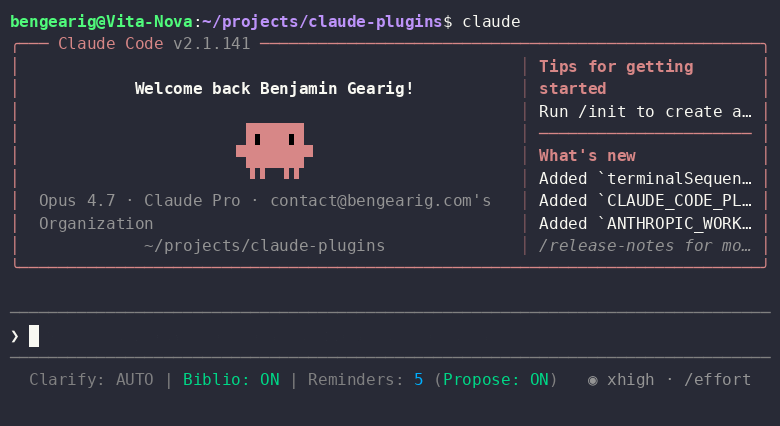

# claude-plugins

Benjamin Gearig's [Claude Code](https://claude.com/claude-code) plugin marketplace. Ships two plugins:

- **verbing** — extra verbs for the Claude Code spinner
- **conscientious** — plan-mode nudges (`/clarify`, `/biblio`, `/remind-me`) plus a combined statusline badge

## Install

```
/plugin marketplace add bengearig/claude-plugins
```

Then enable plugins via `/plugin`, or by adding to your `~/.claude/settings.json`:

```json
"enabledPlugins": {
  "verbing@benjamin-gearig-marketplace": true,
  "conscientious@benjamin-gearig-marketplace": true
}
```

## verbing

Appends custom spinner verbs (Watsoning, Zooting, Manifesting, …) via a SessionStart hook. To customize, edit [`plugins/verbing/verbs.json`](./plugins/verbing/verbs.json) and add or remove entries — changes apply on next session start.

## conscientious

Four commands plus a statusline badge that surface plan-mode hygiene and per-project reminders.

### Commands

| Command | Args | Default | Effect |
| --- | --- | --- | --- |
| `/clarify` | `on \| auto \| off` | `on` | Whether Claude asks thorough clarifying questions in plan mode |
| `/biblio` | `on \| auto \| off` | `auto` | Whether Claude reads repo docs (READMEs, `*.md`, docstrings) while planning |
| `/remind-me` | `[task description]` | — | No arg → list+menu of saved tasks; with arg → save a new task |
| `/remind-me-propose` | `on \| auto \| off` | `on` | Whether Claude offers `/remind-me <…>` when it spots out-of-scope work |

Each toggle has three states: **on** (apply the directive), **auto** (no directive — let Claude behave normally), **off** (apply the opposite directive). Modes are saved per-project; current state is visible in the statusline.

### Statusline

A SessionStart hook installs a stable launcher at `~/.claude/conscientious-statusline.sh` (and `.ps1` on Windows) that resolves the current plugin install at exec time. This means the path in your `settings.json` never goes stale when the plugin updates. On first run the hook proposes this snippet:

```json
"statusLine": {
  "type": "command",
  "command": "bash \"~/.claude/conscientious-statusline.sh\"",
  "refreshInterval": 1
}
```

The rendered badge looks like:

```
Clarify: ON | Biblio: AUTO | Reminders: 3 (Propose: ON)
```

Colors: green = `on`, grey = `auto`, red = `off`, blue = reminder count.



### Reminders

Reminders are stored per-project at `~/.claude/.remind-me/<projectId>.json` (mode `0600`, atomic writes, symlinks refused). Each entry has a title, the original task description, and a generated pickup prompt suitable for a fresh Claude session. `/remind-me` with no arg shows a menu to **send**, **modify**, or **delete** any reminder.

## License

MIT — see [LICENSE](./LICENSE).
